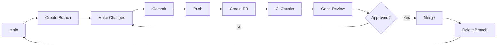

# Git Workflow & PR Process

## 🌳 Branching Strategy

### Branch Structure
```
main           → Production-ready code
├── develop    → Development branch (optional)
└── feature/*  → Feature branches
└── fix/*      → Bug fix branches
└── hotfix/*   → Production hotfixes
```

### Branch Naming Convention
```bash
# Features
feature/add-sms-retry-logic
feature/campaign-scheduling
feature/stripe-integration

# Bug fixes
fix/auth-token-expiration
fix/contact-import-error

# Hotfixes (urgent production fixes)
hotfix/sms-delivery-issue

# Documentation
docs/update-readme
docs/api-documentation
```

## 🚀 Development Workflow

### Step 1: Create a Feature Branch

```bash
# Make sure you're on main and up to date
git checkout main
git pull origin main

# Create and switch to a new feature branch
git checkout -b feature/add-sms-service

# Or for a bug fix
git checkout -b fix/auth-issue
```

### Step 2: Make Your Changes

```bash
# Work on your feature
# Edit files, write code...

# Check what changed
git status
git diff
```

### Step 3: Commit Your Changes

```bash
# Stage your changes
git add .

# Or stage specific files
git add apps/api/src/modules/sms/

# Commit with conventional commit message
git commit -m "feat(sms): implement SMS service with Twilio integration"

# More examples:
# git commit -m "fix(auth): resolve JWT token expiration bug"
# git commit -m "docs(readme): update installation instructions"
# git commit -m "refactor(contacts): improve query performance"
```

**Commit Message Format:**
```
<type>(<scope>): <subject>

Types:
- feat: New feature
- fix: Bug fix
- docs: Documentation
- style: Formatting
- refactor: Code restructuring
- test: Adding tests
- chore: Maintenance
```

### Step 4: Push Your Branch

```bash
# Push your branch to GitHub
git push origin feature/add-sms-service

# If it's your first push on this branch
git push -u origin feature/add-sms-service
```

### Step 5: Create a Pull Request

#### Option A: Via GitHub Web UI
1. Go to https://github.com/FHNexius/nuursend-sms-platform
2. You'll see a banner: "Compare & pull request"
3. Click it
4. Fill out the PR template
5. Request reviewers
6. Create pull request

#### Option B: Via GitHub CLI (gh)
```bash
# Install GitHub CLI first: https://cli.github.com/
gh pr create --title "Add SMS service implementation" --body "Implements SMS service with Twilio integration"
```

### Step 6: Wait for CI/CD Checks

GitHub Actions will automatically run:
- ✅ Linting
- ✅ Type checking
- ✅ Tests
- ✅ Build verification

**If checks fail:**
```bash
# Fix the issues locally
# Then commit and push
git add .
git commit -m "fix: resolve linting errors"
git push
```

### Step 7: Code Review

- Address reviewer comments
- Make changes as requested
- Push updates (they'll automatically update the PR)

```bash
# Make requested changes
git add .
git commit -m "refactor: address PR review comments"
git push
```

### Step 8: Merge the PR

Once approved and all checks pass:
1. **Squash and merge** (recommended for clean history)
2. **Merge commit** (keeps all commits)
3. **Rebase and merge** (linear history)

### Step 9: Clean Up

```bash
# Switch back to main
git checkout main

# Pull the latest changes
git pull origin main

# Delete your local feature branch
git branch -d feature/add-sms-service

# Delete remote branch (GitHub can do this automatically)
git push origin --delete feature/add-sms-service
```

## 🔄 Keeping Your Branch Up to Date

### Sync with Main Branch

```bash
# While on your feature branch
git checkout feature/your-feature

# Fetch latest from main
git fetch origin main

# Rebase your changes on top of main
git rebase origin/main

# If there are conflicts, resolve them
# Then continue the rebase
git rebase --continue

# Force push (only on feature branches!)
git push --force-with-lease
```

### Alternative: Merge Instead of Rebase

```bash
# While on your feature branch
git checkout feature/your-feature

# Merge main into your branch
git merge origin/main

# Resolve conflicts if any
# Then push
git push
```

## 🛡️ Protected Branch Rules

### Main Branch Protection (Recommended Settings)

1. **Require pull request before merging**
   - Require approvals: 1+
   - Dismiss stale reviews

2. **Require status checks to pass**
   - Lint check
   - Type check
   - Tests
   - Build

3. **Require conversation resolution**
4. **Do not allow bypassing**

## 📝 PR Best Practices

### Good PR Characteristics

**Size:**
- ✅ Small, focused PRs (< 400 lines)
- ✅ One feature/fix per PR
- ❌ Avoid massive PRs (> 1000 lines)

**Description:**
- ✅ Clear title
- ✅ Detailed description
- ✅ Screenshots for UI changes
- ✅ Testing instructions
- ✅ Links to related issues

**Code:**
- ✅ All tests passing
- ✅ No linting errors
- ✅ Type-safe
- ✅ Documented

### PR Template Sections

When creating a PR, fill out:
1. **Description**: What does this PR do?
2. **Type of Change**: Feature, fix, docs, etc.
3. **Testing**: How was it tested?
4. **Checklist**: Complete all items
5. **Screenshots**: If UI changes

## 🔍 Code Review Guidelines

### As a Reviewer

**Look for:**
- Functionality correctness
- Code style consistency
- Test coverage
- Security issues
- Performance concerns
- Documentation

**Provide:**
- Constructive feedback
- Specific suggestions
- Praise for good code

**Review types:**
- ✅ **Approve**: LGTM (Looks Good To Me)
- 💬 **Comment**: Suggestions, not blocking
- ❌ **Request Changes**: Must be fixed

### As a PR Author

**Respond to:**
- All comments
- Questions
- Change requests

**Don't:**
- Take feedback personally
- Ignore comments
- Merge without approval

## 🚨 Common Git Issues

### Accidentally Committed to Main

```bash
# Create a new branch from current state
git branch feature/my-work

# Reset main to origin
git reset --hard origin/main

# Switch to your feature branch
git checkout feature/my-work
```

### Want to Undo Last Commit

```bash
# Keep changes, undo commit
git reset --soft HEAD~1

# Discard changes, undo commit
git reset --hard HEAD~1
```

### Merge Conflicts

```bash
# Pull latest changes
git pull origin main

# Git will mark conflicts in files
# Open files, resolve conflicts
# Look for <<<<<<, ======, >>>>>> markers

# After resolving
git add .
git commit -m "fix: resolve merge conflicts"
```

### Forgot to Create Branch

```bash
# You're on main but made changes
git stash

# Create and switch to new branch
git checkout -b feature/my-work

# Apply your changes
git stash pop
```

## 📊 Workflow Summary



## 🎯 Quick Reference

```bash
# Start new feature
git checkout -b feature/name

# Commit changes
git add .
git commit -m "feat(scope): description"

# Push to GitHub
git push -u origin feature/name

# Create PR
# → Go to GitHub or use `gh pr create`

# After merge, cleanup
git checkout main
git pull
git branch -d feature/name
```

## 📚 Additional Resources

- [Conventional Commits](https://www.conventionalcommits.org/)
- [GitHub Flow](https://guides.github.com/introduction/flow/)
- [Git Best Practices](https://git-scm.com/book/en/v2)

---

**Remember**: Commit early, commit often, and always work in feature branches! 🚀

